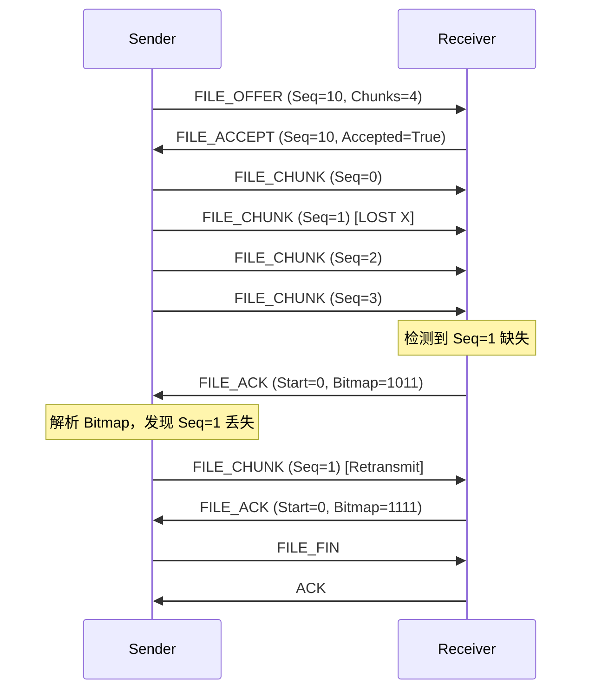

# SerialSync 通信协议 (v2.1)

本文档定义了 SerialSync v2.1 版本的通信协议。相比 v2.0，本版本引入了 COBS 编码、CRC-16 校验和 Bitmap ACK 机制，以显著提升传输的可靠性和效率。

---

## 1. 物理层编码 (Physical Layer Encoding)

为了解决数据中可能出现的帧头混淆问题，并提供可靠的帧同步机制，本协议采用 **COBS (Consistent Overhead Byte Stuffing)** 编码。

*   **帧定界符**：`0x00`。
*   **编码规则**：将原始数据中的 `0x00` 字节消除，替换为指向下一个 `0x00` 的偏移量。
*   **优势**：
    *   数据中绝不会出现 `0x00`，因此 `0x00` 可以唯一地作为帧结束标志。
    *   一旦发生同步丢失，只需等待下一个 `0x00` 即可立即恢复同步（Resync）。
    *   开销极低（约 0.4%）。

**传输流格式**：
`[COBS Encoded Data] [0x00]`

---

## 2. 帧结构 (Frame Structure)

解码 COBS 后，得到的原始二进制帧结构如下：

| 字段 | 长度 (Byte) | 说明 |
| :--- | :--- | :--- |
| **TYPE** | 1 | 包类型 (见下表) |
| **SEQ** | 2 | 序列号 (Big Endian)。请求/响应包用于匹配，数据包用于排序。 |
| **LEN** | 2 | Body 数据长度 (Big Endian) |
| **BODY** | N | 业务数据 (最大 65535) |
| **CRC** | 2 | CRC-16/XMODEM 校验值 (TYPE + SEQ + LEN + BODY) |

> **注意**：不再需要 `HEAD` 字段，因为 COBS 的 `0x00` 已经提供了完美的定界功能。

---

## 3. 核心机制

### 3.1 校验算法
采用 **CRC-16/XMODEM** 算法。
*   Poly: `0x1021`
*   Init: `0x0000`
*   相比简单的 Checksum，CRC 能有效检测出多位翻转、错位等常见传输错误。

### 3.2 确认与重传 (ACK Mechanism)
为了提高文件传输效率，采用 **选择性重传 (Selective Repeat)** 策略，配合 **Bitmap ACK**。

*   **普通 ACK**：收到短消息或命令时，回复 `ACK { seq: 123 }`。
*   **Bitmap ACK**：在文件传输过程中，接收端定期（或检测到丢包时）发送 Bitmap ACK。
    *   格式：`{ startSeq: 100, bitmap: "FFFF00FF..." (Hex String or Base64) }`
    *   含义：从 `startSeq` 开始，Bitmap 中为 `1` 的位表示已收到，`0` 表示丢失。
    *   发送端收到后，仅重传 Bitmap 中为 `0` 的 Chunk。

---

## 4. 包类型定义 (Packet Types)

### 4.1 系统层 (System - P0)

| TYPE | 名称 | 说明 | Body 格式 |
| :--- | :--- | :--- | :--- |
| `0x00` | **PING** | 心跳请求 | 空 |
| `0x01` | **PONG** | 心跳响应 | 空 |
| `0x02` | **HANDSHAKE** | 握手 | JSON: `{ver: 2, caps: ["crc16", "cobs"]}` |
| `0x03` | **ACK** | 通用确认 | JSON: `{seq: 123}` |
| `0x04` | **NACK** | 显式拒收/重传请求 | JSON: `{seq: 123, reason: "crc_error"}` |

### 4.2 消息层 (Message - P1)

| TYPE | 名称 | 说明 | Body 格式 |
| :--- | :--- | :--- | :--- |
| `0x10` | **MSG_TEXT** | 文本消息 | UTF-8 String |
| `0x11` | **CMD_REQ** | RPC 请求 | JSON: `{method: "get_status", params: {}}` |
| `0x12` | **CMD_RESP** | RPC 响应 | JSON: `{result: ...} or {error: ...}` |

### 4.3 传输层 (Transfer - P2/P3)

| TYPE | 名称 | 说明 | Body 格式 |
| :--- | :--- | :--- | :--- |
| `0x20` | **FILE_OFFER** | 发送文件请求 | JSON: `{id: "uuid", name: "a.txt", size: 1024, hash: "md5...", chunks: 10}` |
| `0x21` | **FILE_ACCEPT** | 接受/续传响应 | JSON: `{id: "uuid", accepted: true, bitmap: "..."}` |
| `0x22` | **FILE_CHUNK** | 文件数据块 | `[FileID(16B UUID)] [ChunkSeq(2B)] [Data(N)]` *注：此处Body为自定义二进制结构以节省空间* |
| `0x23` | **FILE_ACK** | 文件块确认 | JSON: `{id: "uuid", start: 0, bitmap: "..."}` |
| `0x24` | **FILE_FIN** | 传输完成校验 | JSON: `{id: "uuid", hash: "..."}` |

---

## 5. 交互时序图 (示例)

### 5.1 文件传输 (含丢包重传)

