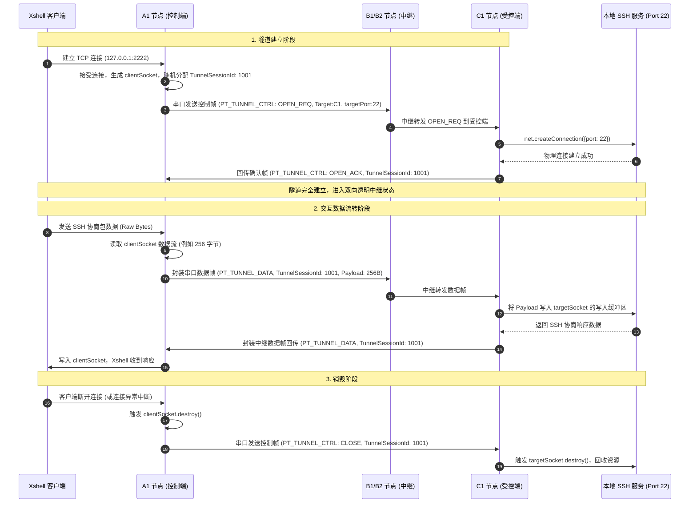

# 基于跨网 TCP 隧道的远程控制可行性评估报告

## 一、方案核心理念：TCP 隧道转发 (Port Forwarding over Relay)

经过进一步对使用场景的对齐，**不打算在 Web UI 中集成终端模拟器，也不在受控端创建 Shell 进程**。

系统将采用类似 **SSH 端口转发 / 动态隧道 (TCP Tunneling)** 的工作机制：
*   **控制端 (A网)**：由本系统在控制端主机的局域网内开启一个本地 TCP 监听端口（例如 `127.0.0.1:2222`）。
*   **受控端 (C网)**：直接通过 TCP 连接本地真实的终端服务（如本机或同网段服务器的 SSH 服务 `127.0.0.1:22` 或 Telnet 服务 `127.0.0.1:23`）。
*   **传输介质 (中继)**：系统只负责对两端 TCP 流量（原始 Byte 流）进行分包、多路复用，通过现有的 **“串口 ⇄ WebSocket 中继”** 链路进行透明传输。
*   **控制终端**：用户直接使用自己熟悉的通用终端软件（如 **PuTTY, MobaXterm, Xshell, SecureCRT, 系统原生 SSH 命令行**）连接本网内开放的本地端口，实现无缝的终端交互。

---

## 二、架构优势分析

相比于“在 Web UI 里集成 xterm.js + node-pty 进程管理”的方案，**TCP 隧道转发方案具有压倒性的优势**：

| 维度 | 网页集成终端方案 | 本地 TCP 端口转发方案 (本次方案) | 评估结论 |
| :--- | :--- | :--- | :--- |
| **外部依赖** | 强依赖 `xterm.js`，后端强依赖 `node-pty` (原生 C++ 编译) | **零二进制依赖**。仅使用 Node.js 原生的 `net` 核心库。 | **极易部署与打包**，符合系统免配即用的原则。 |
| **客户端兼容性** | 易产生退格、行折叠、中文乱码等兼容性问题，不支持交互式 CLI 工具 (如 Vim) | **100% 兼容**。终端排版、热键、交互全部由专业的终端软件（如 Xshell）自己处理。 | **用户体验最佳**，操作无阻碍。 |
| **协议适用性** | 仅限于命令行交互 (Shell)。 | **协议无关，通用 TCP 转发**。不仅能传 SSH 终端，还能转发 RDP 远程桌面、VNC、Web 服务、MySQL 数据库等。 | **功能扩展性强**，商业及运维价值极大。 |
| **系统侵入度** | 高。需要管理复杂的多进程生命周期，一旦泄漏会导致受控机僵死。 | **低**。仅做 TCP Socket 的数据中继，生命周期完全与 socket 绑定，极易防范资源泄漏。 | **稳定性和安全性显著提升**。 |

---

## 三、系统架构与数据流设计

以下以用户从 A网 主机使用 Xshell，通过三网级联中继，SSH 连接 C网 的受控端主机为例：

### 3.1 数据流路由图

```mermaid
graph TD
    %% 客户端软件
    Xshell[外部 Xshell 客户端] <-->|TCP 连接 127.0.0.1:2222| A_Server[A1 节点 ApiServer]

    subgraph A网 (控制端)
        A_Server
    end

    subgraph B网 (中继网段)
        B1[B1 中继节点] <-->|WebSocket: 隧道数据帧| B2[B2 中继节点]
    end

    subgraph C网 (受控端)
        C_Server[C1 节点 ApiServer]
    end

    %% 受控端真实服务
    C_SSH[C1 真实 SSH 服务 127.0.0.1:22] <-->|TCP Socket 读写| C_Server

    %% 物理链路
    A_Server <-->|物理串口 115200bps| B1
    B2 <-->|物理串口 115200bps| C_Server

    %% 样式
    classDef client fill:#f9f9f9,stroke:#333,stroke-dasharray: 5, 5;
    classDef node fill:#cce5ff,stroke:#004085,stroke-width:2px;
    classDef service fill:#d4edda,stroke:#28a745,stroke-width:2px;
    class Xshell client;
    class A_Server,B1,B2,C_Server node;
    class C_SSH service;
```

### 3.2 详细消息交互时序



---

## 四、核心实现方案设计

系统可以设计一个全新的核心模块 `TunnelService`。其主要设计细节如下：

### 4.1 协议帧扩展 (`PacketCodec.js`)

在串口协议中定义两类专门用于 TCP 隧道的帧类型：
1.  **`PT.TUNNEL_CTRL (0x40)`**：隧道生命周期控制帧。
    *   **载荷设计**：
        ```
        [1 字节 command] + [2 字节 sessionId] + [目标节点长度(1)] + [目标节点名] + [目标端口(2)]
        ```
    *   `command` 类型：`0x01` (OPEN_REQ)、`0x02` (OPEN_ACK)、`0x03` (OPEN_REJ)、`0x04` (CLOSE_REQ)。
2.  **`PT.TUNNEL_DATA (0x41)`**：隧道数据承载帧。
    *   **载荷设计**：
        ```
        [2 字节 sessionId] + [实际 TCP 流的二进制 Payload]
        ```

### 4.2 控制端与受控端的 `TunnelService` 职责

#### 4.2.1 控制端监听器（TCP Server）
当在系统配置中开启某个隧道后：
1.  控制端通过 Node.js 的 `net.createServer()` 监听 `localPort`（支持指定 IP，例如 `127.0.0.1` 确保安全，或 `0.0.0.0` 开放给局域网）。
2.  每当有外部连接连入，使用 `Map<sessionId, Socket>` 将新 socket 保存，分配唯一的自增 `sessionId`。
3.  启动该连接的缓存队列，向串口/中继链路发起 `OPEN_REQ` 信号。
4.  监听 socket 的 `'data'` 事件，将读入的数据分块并通过串口队列发送。

#### 4.2.2 受控端连接器（TCP Client）
1.  当受控端收到来自中继的 `OPEN_REQ` 且目标节点为本节点时，调用 `net.createConnection({ host: targetHost, port: targetPort })` 发起物理连接。
2.  若连接建立成功，回复 `OPEN_ACK`；若失败（如目标服务未开启），回复 `OPEN_REJ` 并关闭会话。
3.  维护 `targetSocket`，将收到的 `PT.TUNNEL_DATA` 写入，同时将 `targetSocket` 吐出的数据打包回传给控制端。

---

## 五、关键技术挑战与解决策略

### 5.1 串口带宽与拥堵控制
*   **挑战**：虽然 SSH 控制台的数据流量非常轻量，但是有些命令（如 `cat` 大日志，或是执行包含大段屏幕刷新文本的命令）会产生短时的数据洪峰。
*   **优化对策**：
    1.  **数据流分包与流量控制 (Flow Control)**：在控制端和受控端的 socket 读取时，设置节流阈值。在串口中继层对单帧数据设置上限（如单帧 Payload最大 1024 字节），如果串口发送队列的积压帧数（可通过 [PacketScheduler](file:///e:/nodejs/serialSync/src/core/transport/PacketScheduler.js) 队列长度监控）过高，**暂停 socket 的 `read` 读取 (`socket.pause()`)**；当队列恢复空闲时，再调用 `socket.resume()` 恢复读取。这利用了 TCP 天然的背压 (Backpressure) 机制，能确保系统稳定，不崩溃，不丢包。
    2.  **流式轻量压缩**：利用 Node.js 内置的 `zlib.deflateRaw` / `inflateRaw` 在串口传输段对数据进行压缩。文本流压缩比通常极高（3x~5x），可大幅节省串口带宽。

### 5.2 多路复用 (Multiplexing)
*   **挑战**：用户可能会同时打开多个终端窗口连接本地端口，或者多个不同的服务共用一个中继信道，必须保证数据流互不干扰。
*   **解决对策**：串口帧中的 `sessionId` 必须在全链路唯一。控制端通过当前节点标识前缀 + 自增 ID（如 `A1_1001`）生成唯一的会话标识。两端在分发 and 接收时，均严格根据 `sessionId` 寻址对应的 socket 实例。

### 5.3 异常回收机制
*   **挑战**：若物理链路突然断开，由于没有显式关闭信号，受控端到真实服务的 TCP 连接可能会一直保持挂起（处于 ESTABLISHED 状态），导致受控机资源泄漏。
*   **解决对策**：
    *   两端建立心跳检测，或者与本系统既有的链路心跳联动。
    *   一旦触发 `linkLost`（串口连路丢失）或 WebSocket 连接断开，受控端的 `TunnelService` 必须**遍历并强制销毁所有处于活跃状态的隧道 Socket (`socket.destroy()`)**，确保无死锁进程和泄漏端口。

---

## 六、安全防护建议 (高危控制防范)

端口转发是一把双刃剑（相当于跨网段的内网穿透隧道）。受控端必须进行细粒度的安全控制：

1.  **受控端目标白名单 (Target Whitelist)**：
    受控端可在配置中限制“允许被跨网访问的内部 IP 和 Port 范围”。例如，只允许转发到受控机本机的 SSH 服务端口：
    ```json
    {
      "tunnel": {
        "allowRemoteTunnel": true,
        "targetWhitelist": [
          "127.0.0.1:22",
          "127.0.0.1:23"
        ]
      }
    }
    ```
    任何不在此白名单中的目标请求（如尝试连接内网其它关键数据库或服务器），受控端一律返回 `OPEN_REJ` 并断开连接。
2.  **隧道源 IP 限制**：
    控制端开放的本地 TCP 端口（如 2222）默认只应绑定在 `127.0.0.1` 环回网卡上，只允许控制机本机的客户端软件访问，防止控制端所在局域网内的其它未授权主机滥用此隧道。

---

## 七、开发推进规划

```
┌─────────────────────────────────┐     ┌─────────────────────────────────┐
│     第一阶段：本地 TCP 服务桥接     │ ──> │     第二阶段：串口中继与背压流控    │
└─────────────────────────────────┘     └─────────────────────────────────┘
  - 编写 TunnelService 原型              - 在 PacketCodec 增加 0x40/41 帧
  - 实现本地 TCP Server 与 Socket 管理   - 引入流式压缩 (zlib)
  - 实现 Session 状态的创建与清理逻辑      - 实现 socket.pause/resume 背压机制
```

## 八、总结评估结论

基于 TCP 端口转发的跨网终端方案在**技术可行性上完美**，实现难度显著低于内置终端模拟器的方案，具有**高兼容性、高通用性、免编译依赖**的巨大优势。该方案完全符合本系统作为“网络中继与数据转发器”的架构定位。
